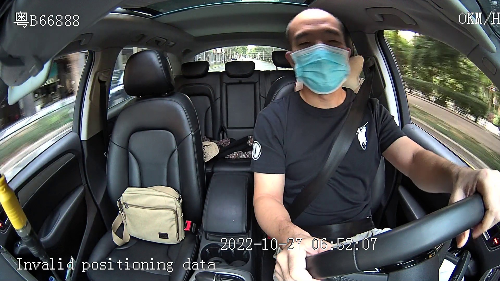
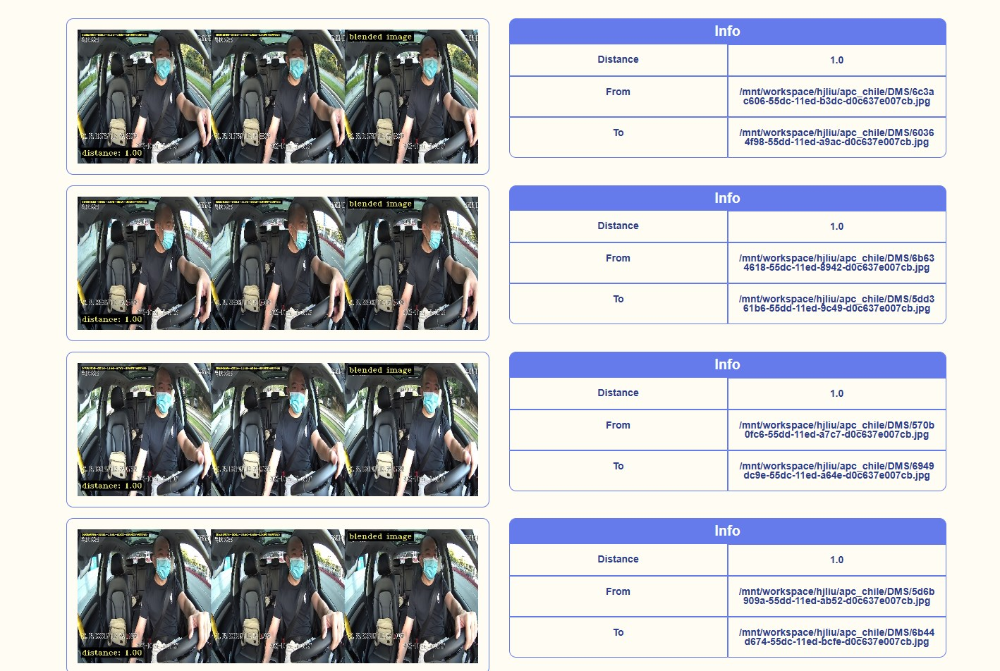
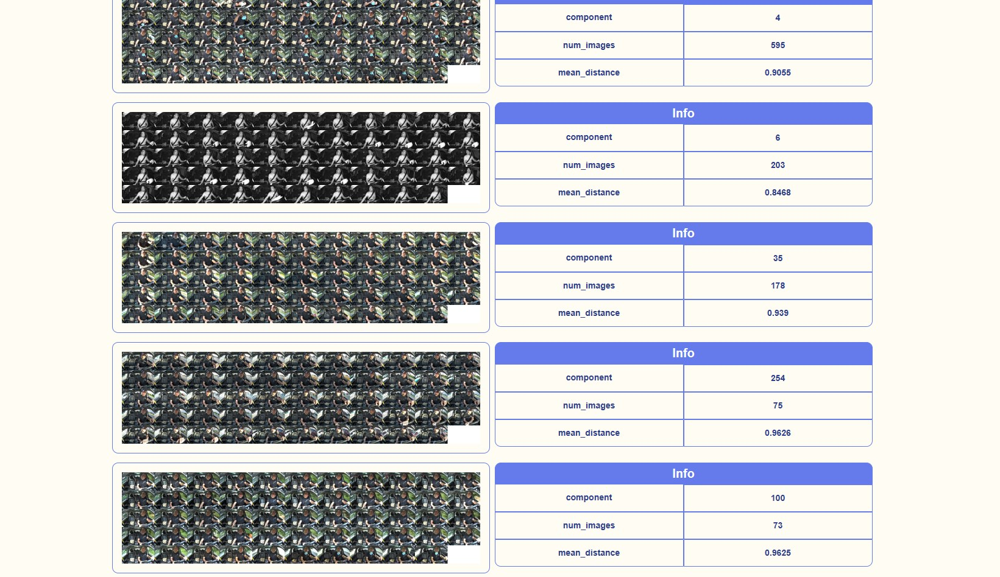
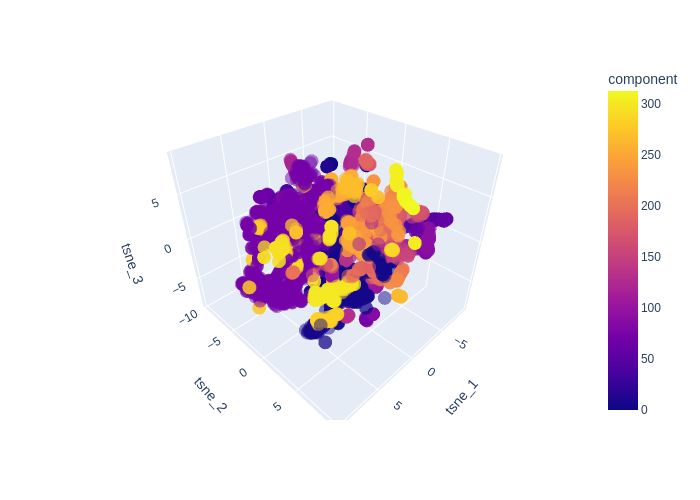
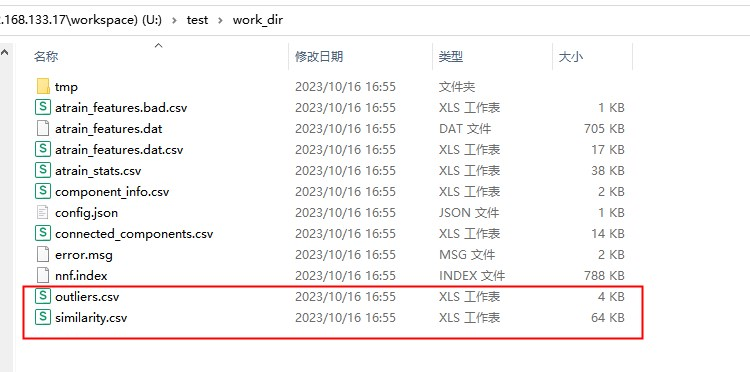

## Abstract
This project is generalized data analysis and process frame.
- support duplicate.
- support image search.
- support clean image dataset.
- support Visualize  of image dataset.
- support extract feature vectors of your images using DINOv2 model. Runs on CPU.

## :rocket: Example
<div style="display:inline-block">
  
  
  
  
</div>

## :rocket: **Install** 
python需要3.7以上版本
```python
pip install fastdup==1.44
pip install plotly
pip install scikit-learn
```

## :rocket: **How to use** 
When dinov2 used for the first time, the dinov2 model will be downloaded.
You can download the model in advance and put it in the corresponding location.
download link:https://vl-company-website.s3.us-east-2.amazonaws.com/model_artifacts/dinov2/dinov2_vitb14.onnx.
### clean image dataset
```python
python main.py 0 /mnt/workspace/hjliu/apc_chile/DMS /mnt/workspace/hjliu/apc_chile/results -d Fasle -n 20

optional arguments:
'/mnt/workspace/hjliu/apc_chile/DMS' : input image dataset
'/mnt/workspace/hjliu/apc_chile/results' : path to save results
-d : whether use dinov2 to extract feature vectors
-n : number of save image for visual image, eg: n=-1, save all result images
```
### delete duplicate images
get delete duplicate image in root path,be careful when calling this function 
```python
python main.py 1 /mnt/workspace/hjliu/apc_chile/DMS /mnt/workspace/hjliu/apc_chile/results
```
### image search 
```python
python main.py 2 /mnt/workspace/hjliu/apc_chile/DMS /mnt/workspace/hjliu/apc_chile/results -q /mnt/workspace/hjliu/test/query.jpg -k 10

optional arguments:
-q : path to query image
-k : number of retrieval image
```

## :sunflower: Debug Information.Please note
After performing image search operation, similar.csv and outliers.csv will change in work_dir file, please make a copy in advance as a backup.
Of course, this may have something to do with the Fastup version installed.
